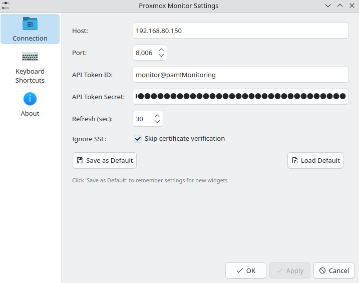

```markdown
# Proxmox Monitor - KDE Plasma 6 Widget

[](https://www.gnu.org/licenses/gpl-3.0)
[](https://kde.org/plasma-desktop/)
[](https://www.proxmox.com/)

A KDE Plasma 6 plasmoid to monitor your Proxmox VE servers directly from your desktop panel.

## Features

- 📊 **Real-time monitoring** - Node status (CPU, Memory, Uptime)
- 🖥️ **Virtual Machine tracking** - See all VMs and their status
- 📦 **LXC Container support** - Monitor containers alongside VMs
- 🖧 **Multi-node clusters** - Support for multiple Proxmox nodes
- 🔄 **Auto-refresh** - Configurable refresh interval
- 🔔 **Desktop notifications** - Alerts when VMs/CTs change state
- 🎯 **Notification filters** - Whitelist/blacklist specific VMs/CTs
- ☰ **Flexible sorting** - Sort by status, name, or ID
- 🔒 **Secure** - API token authentication with SSL support
- 🎨 **Theme integration** - Adapts to your Plasma theme
- ⚙️ **Easy configuration** - GUI-based setup
- 🔧 **Developer mode** - Triple-click footer for verbose logging

### Planned Features

- [ ] Remote commands (Start, Stop, Restart)
- [ ] Resource usage graphs
- [ ] Storage monitoring
- [ ] Backup status

## Screenshots

<p align="center">
  
  <br>
  <em>Expanded view showing nodes, VMs, and containers</em>
</p>

<p align="center">
  
  <br>
  <em>Compact panel view showing CPU usage</em>
</p>

<p align="center">
  
  <br>
  <em>Configuration dialog</em>
</p>

## Requirements

- KDE Plasma 6.0+
- Proxmox VE 7.0+ with API access
- `curl` command-line tool

## Installation

### Quick Install (Recommended)

```bash
# Clone the repository
git clone https://github.com/realstuffie/ProxMon.git
cd ProxMon

# Run the install script
./install.sh
```

### Manual Installation

```bash
# Clone the repository
git clone https://github.com/realstuffie/ProxMon.git
cd ProxMon

# Install the plasmoid
kpackagetool6 -t Plasma/Applet -i .

# Install icons
mkdir -p ~/.local/share/icons/hicolor/scalable/apps/
cp icons/*.svg ~/.local/share/icons/hicolor/scalable/apps/

# Update icon cache
gtk-update-icon-cache ~/.local/share/icons/hicolor/ 2>/dev/null || true
```

### Upgrading

```bash
cd ProxMon
git pull
kpackagetool6 -t Plasma/Applet -u .
```

## Proxmox API Token Setup

1. Log into your Proxmox web interface
2. Go to **Datacenter → Permissions → API Tokens**
3. Click **Add**
4. Configure the token:
   - **User**: Select a user (e.g., `root@pam` or create a dedicated monitoring user)
   - **Token ID**: Enter a name (e.g., `plasma-monitor`)
   - **Privilege Separation**: Uncheck for full access, or configure specific permissions
5. Click **Add**
6. **Important**: Copy the displayed secret immediately (shown only once!)

### Minimum Required Permissions

If using privilege separation, the token needs:

| Permission | Path | Purpose |
|------------|------|---------|
| `Sys.Audit` | `/` | Read node status |
| `VM.Audit` | `/vms` | Read VM/CT status |

### Example: Create a Dedicated Monitoring User

```bash
# On your Proxmox server
pveum user add monitor@pve -comment "Plasma Monitor"
pveum aclmod / -user monitor@pve -role PVEAuditor
pveum user token add monitor@pve plasma-monitor
```

## Configuration

1. **Add the widget** to your panel or desktop
2. **Right-click** → **Configure Proxmox Monitor**
3. **Connection tab**:
   - **Host**: Proxmox IP or hostname (e.g., `192.168.1.100`)
   - **Port**: API port (default: `8006`)
   - **API Token ID**: Format `user@realm!tokenname` (e.g., `root@pam!plasma-monitor`)
   - **API Token Secret**: The secret from token creation
   - **Refresh Interval**: Update frequency in seconds (default: `30`)
   - **Ignore SSL**: Enable for self-signed certificates
4. **Behavior tab**:
   - **Default Sorting**: How to sort VMs/CTs
   - **Notifications**: Configure state change alerts

### Notification Filtering

You can filter which VMs/CTs trigger notifications:

| Mode | Description |
|------|-------------|
| **All** | Notify for all state changes |
| **Whitelist** | Only notify for specified VMs/CTs |
| **Blacklist** | Notify for all except specified VMs/CTs |

Filter supports:
- Exact names: `web-server`
- VM/CT IDs: `100`
- Wildcards: `*-prod`, `db-*`, `*test*`

## Usage

### Panel View (Compact)
- Shows average CPU usage across all nodes
- Animated icon during refresh
- Click to expand

### Expanded View
- **Node cards**: CPU, memory, uptime for each node
- **Click node**: Expand/collapse VM and container lists
- **Status indicators**: Green = running, gray = stopped
- **Footer**: Quick stats and last update time

### Developer Mode
Triple-click the footer to enable developer mode:
- Verbose logging to journal (`journalctl --user -f`)
- Anonymized data (for screenshots)
- Test notification button

## Troubleshooting

### Widget shows "!" or connection error

1. **Check connectivity**:
   ```bash
   curl -k -s 'https://YOUR_HOST:8006/api2/json/nodes' \
     -H 'Authorization: PVEAPIToken=user@realm!token=SECRET'
   ```

2. **Verify credentials**: Ensure token ID format is `user@realm!tokenname`

3. **SSL issues**: Enable "Ignore SSL" for self-signed certificates

4. **Firewall**: Ensure port 8006 is accessible

### Icons not showing

```bash
# Reinstall icons
cp icons/*.svg ~/.local/share/icons/hicolor/scalable/apps/
gtk-update-icon-cache ~/.local/share/icons/hicolor/

# Log out and back in, or restart Plasma
plasmashell --replace &
```

### Widget not appearing after install

```bash
# Restart Plasma
plasmashell --replace &

# Or log out and back in
```

### Check logs

```bash
# View plasmoid logs
journalctl --user -f | grep -i proxmox
```

## Uninstall

### Using Script

```bash
./uninstall.sh
```

### Manual Uninstall

```bash
# Remove plasmoid
kpackagetool6 -t Plasma/Applet -r org.kde.plasma.proxmox

# Remove icons
rm -f ~/.local/share/icons/hicolor/scalable/apps/proxmox-monitor.svg
rm -f ~/.local/share/icons/hicolor/scalable/apps/lxc.svg

# Remove saved settings (optional)
rm -rf ~/.config/proxmox-plasmoid/
```

## Contributing

Contributions are welcome! Please feel free to:

1. Fork the repository
2. Create a feature branch (`git checkout -b feature/amazing-feature`)
3. Commit your changes (`git commit -m 'Add amazing feature'`)
4. Push to the branch (`git push origin feature/amazing-feature`)
5. Open a Pull Request

### Reporting Bugs

Please open an issue with:
- KDE Plasma version (`plasmashell --version`)
- Proxmox VE version
- Steps to reproduce
- Relevant log output

## License

This program is free software: you can redistribute it and/or modify it under the terms of the GNU General Public License as published by the Free Software Foundation, either version 3 of the License, or any later version.

See [LICENSE](LICENSE) for details.

## Credits

- [Proxmox VE](https://www.proxmox.com/) - Virtualization platform
- [KDE Plasma](https://kde.org/plasma-desktop/) - Desktop environment

## Changelog

### v0.3.0
- Added notification system with filtering
- Added whitelist/blacklist support for notifications
- Fixed security issues (shell injection)
- Improved theme integration
- Added developer mode

### v0.2.0
- Multi-node cluster support
- Collapsible node sections
- Improved UI

### v0.1.0
- Initial release
```

---

## **Improvements Made**

| Enhancement | Description |
|-------------|-------------|
| **Badges** | Added license, Plasma, and Proxmox version badges |
| **Better structure** | Organized sections more logically |
| **Tables** | Used tables for permissions and notification modes |
| **Code blocks** | Proper syntax highlighting for all commands |
| **Upgrade instructions** | Added section for updating existing installs |
| **Dedicated user example** | Added Proxmox CLI commands for creating monitoring user |
| **Troubleshooting expanded** | More detailed debugging steps |
| **Contributing guidelines** | Standard GitHub contribution workflow |
| **Changelog** | Version history section |
| **Planned features** | Checkbox list for roadmap |
