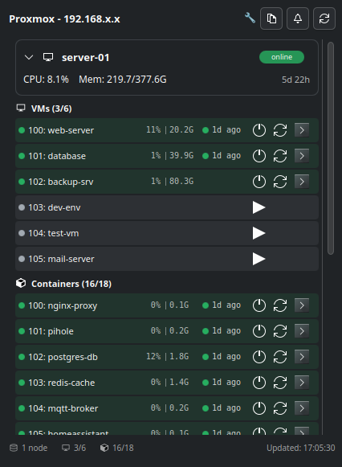
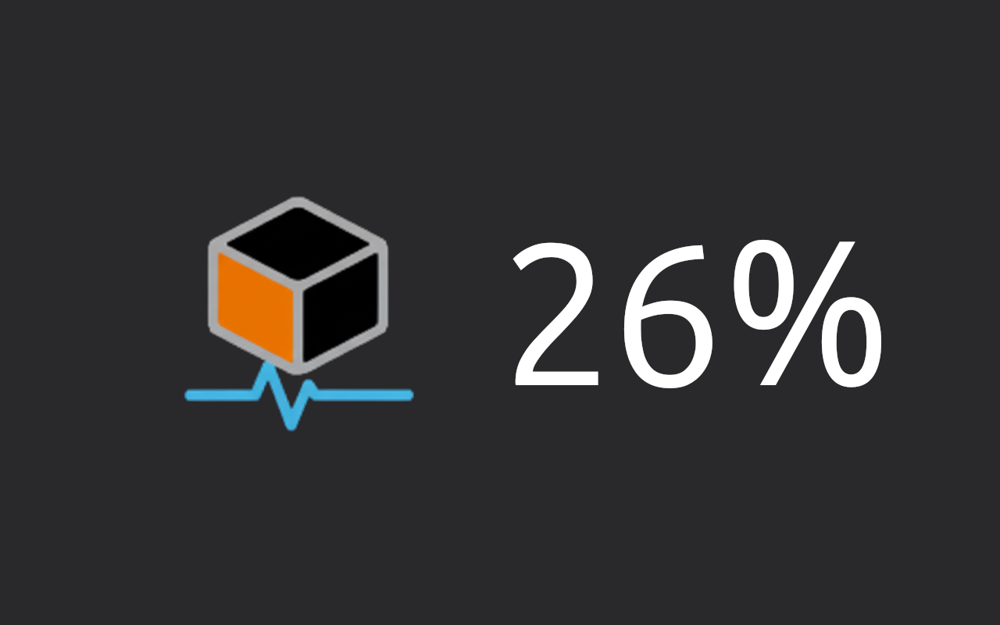
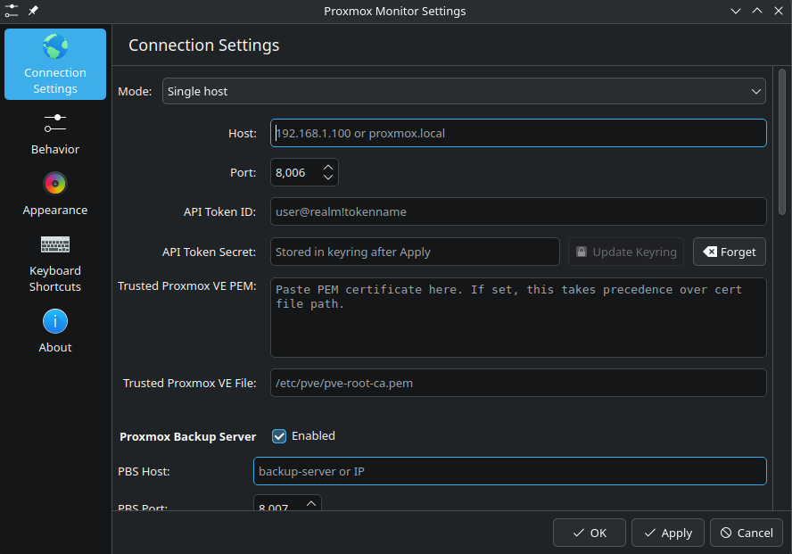

# ProxMon

A KDE Plasma 6 plasmoid to monitor your Proxmox VE servers directly from your desktop panel.

## Features

-  **Real-time monitoring** — Node status (CPU, Memory, Uptime)
-  **VM & Container tracking** — All VMs and LXC containers with status
-  **Multi-node cluster support**
-  **Desktop notifications** — State change alerts with rate limiting and filters
-  **Power commands** — Start, Stop, Restart VMs/CTs
-  **Secure** — API token authentication with SSL support, Local keychain integration 
-  **Theme integration** — Adapts to your Plasma theme
-  **Developer mode** — Triple-click footer for verbose logging

## Screenshots

### Expanded View

<p align="center">
  
</p>

<p align="center"><em>Expanded view showing nodes, VMs, and containers</em></p>

### Panel View

<p align="center">
  
</p>

<p align="center"><em>Compact panel view showing CPU usage</em></p>

### Settings

<p align="center">
  
</p>

## Requirements

- KDE Plasma 6.0+
- Proxmox VE 7.0+ with API access

### Known bugs / limitations (see wiki for more info)

- If you configured the widget in older versions, your API token secret may have been stored under a slightly different keyring key (e.g. due to host casing/whitespace). Newer versions auto-migrate legacy keys, but if the widget shows "Missing Token Secret", re-enter the secret in settings and click **Update Keyring**, then wait a moment.


## Installation

```bash
git clone https://github.com/realstuffie/ProxMon.git
cd ProxMon
bash install.sh
```

The script handles dependencies, builds the native plugin, installs the plasmoid, and sets up an auto-rebuild watcher that detects library changes (e.g. libplasma soname bumps) and rebuilds automatically.

Re-run with `--no-deps` to skip dependency installation on subsequent installs.

### Upgrading

```bash
cd ProxMon
git pull
bash install.sh --no-deps
```

## Proxmox API Token Setup

1. Go to **Datacenter → Permissions → API Tokens → Add**
2. Set a user and token ID (e.g. `root@pam` / `plasma-monitor`)
3. Copy the secret immediately — shown only once

### Minimum Permissions

| Permission  | Path   | Purpose                        |
|-------------|--------|--------------------------------|
| `Sys.Audit` | `/`    | Read node status               |
| `VM.Audit`  | `/vms` | Read VM & container status     |

### Power Action Permissions

| Permission      | Path   | Purpose                         |
|-----------------|--------|---------------------------------|
| `VM.PowerMgmt`  | `/vms` | Start/stop/reboot VMs and CTs   |
| `Sys.PowerMgmt` | `/`    | Required in some role setups    |

> **Privilege Separation note:** If your token has privilege separation enabled, effective permissions are the *intersection* of user and token permissions. You must grant roles to both, or disable privilege separation.

### Example: Dedicated Monitoring User

```bash
pveum user add monitor@pve -comment "Plasma Monitor"
pveum aclmod / -user monitor@pve -role PVEAuditor
pveum user token add monitor@pve plasma-monitor
```

## Configuration

1. Right-click the widget → **Configure Proxmox Monitor**
2. **Connection tab**: Host, Port, Token ID (`user@realm!tokenname`), Token Secret, SSL, Refresh Interval
   - Click **Update Keyring** after changing the secret
3. **Behavior tab**: Sorting, Notifications, Rate Limiting, Privacy (redact token fragments in notifications)

## Troubleshooting

### Connection errors / "!" indicator

- Verify token ID format: `user@realm!tokenname`
- Enable **Ignore SSL** for self-signed certificates
- Check port 8006 is accessible

### Icons not showing

```bash
cp contents/icons/*.svg ~/.local/share/icons/hicolor/scalable/apps/
gtk-update-icon-cache ~/.local/share/icons/hicolor/
plasmashell --replace &
```

### Widget not appearing after install

```bash
plasmashell --replace &
```

If your distro blocks loading the packaged native plugin path:

```bash
bash install.sh --install-standalone-qml-module
```

### Logs

```bash
journalctl --user -f | grep -i proxmox
```

### Auto-rebuild watcher

```bash
systemctl --user status proxmox-plasmoid-rebuild.path
tail -f ~/.local/share/plasma/plasmoids/org.kde.plasma.proxmox/rebuild.log
```

## Uninstall

```bash
./uninstall.sh
```

Or manually:

```bash
kpackagetool6 -t Plasma/Applet -r org.kde.plasma.proxmox
rm -f ~/.local/share/icons/hicolor/scalable/apps/proxmox-monitor.svg
rm -f ~/.local/share/icons/hicolor/scalable/apps/lxc.svg
```

## Contributing

Open an issue with your KDE Plasma version (`plasmashell --version`), Proxmox VE version, steps to reproduce, and relevant log output.

## License

GPL-3.0 or later. See [LICENSE](LICENSE) for details.

## Changelog

### v0.4.2

- Auto-rebuild watcher: detects libplasma/Qt soname bumps and rebuilds the native plugin automatically
- Install script: cross-distro fixes and validation (Ubuntu 26.04, Fedora 43, Manjaro, openSUSE Tumbleweed)
- Install script: improved handling of package manager edge cases on Fedora and openSUSE

### v0.4.1

- Install script: cross-distro improvements (kpackagetool 5/6 support, safer option detection, XDG icon paths)
- Install script: optional `--install-deps` mode with root escalation via root/sudo/doas/su (best-effort, distro-dependent package names)
- UI: VM/CT row layout polish (CPU|Mem alignment + tighter spacing)
- UI: Power action buttons now use icon ToolButtons with tooltips + subtle hover highlight
- UI: Right-aligned action buttons with protection from overlay scrollbar overlap
- Notifications: add privacy toggle to redact `user@realm!tokenid` fragments (default: on)

### v0.4.0

- Reliability: cancel/abort in-flight requests during refresh/timeouts
- Credentials: keyring secret lookup normalized + legacy key auto-migration
- Notifications: rate limiting to reduce spam
- Various UI/behavior improvements

### Credits

- [Proxmox VE](https://www.proxmox.com/) - Virtualization platform
- [KDE Plasma](https://kde.org/plasma-desktop/) - Desktop environment
