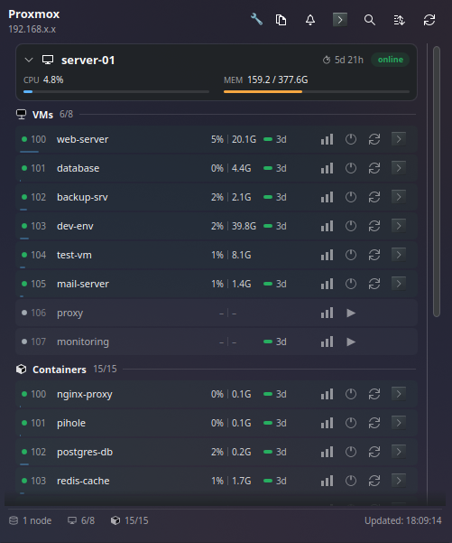
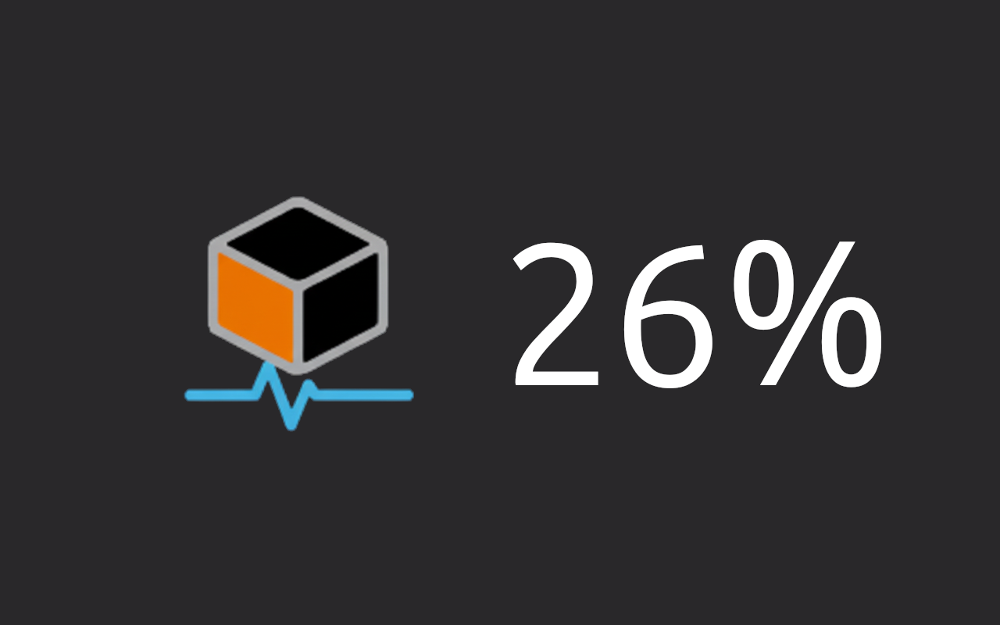
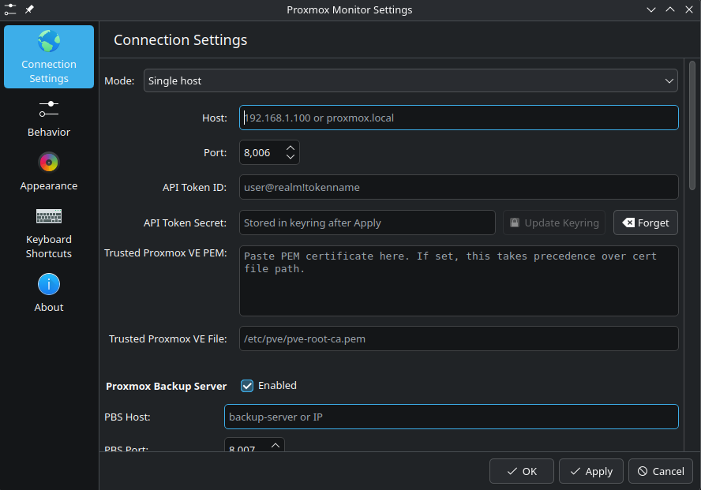

<div align="center">


<h1>ProxMon</h1>

<p><strong>Monitor your Proxmox VE servers straight from the KDE Plasma panel.</strong></p>

<p>Live node, VM &amp; container stats · in-widget VNC &amp; LXC consoles · PBS backup status · multi-host.</p>

<p>
  
  
  
  
  
  
</p>

<p>
  <a href="#installation">Install</a> ·
  <a href="#configuration">Configure</a> ·
  <a href="#security">Security</a> ·
  <a href="#troubleshooting">Troubleshooting</a>
</p>

</div>

---

<div align="center">
<table>
  <tr>
    <td rowspan="2" align="center" valign="middle"><div align="center">
      <br />
      <em>Expanded view — nodes, VMs &amp; containers</em>
    </div></td>
    <td align="center" valign="top"><div align="center">
      <br />
      <em>Compact panel label</em>
    </div></td>
  </tr>
  <tr>
    <td align="center" valign="top"><div align="center">
      <br />
      <em>Configuration</em>
    </div></td>
  </tr>
</table>
</div>

---

## Contents

- [Features](#features)
- [Requirements](#requirements)
- [Installation](#installation)
- [Proxmox API token setup](#proxmox-api-token-setup)
- [Proxmox Backup Server setup](#proxmox-backup-server-setup)
- [Configuration](#configuration)
- [Security](#security)
- [Troubleshooting](#troubleshooting)
- [Contributing](#contributing)
- [Credits](#credits)
- [License](#license)
- [Changelog](#changelog)

## Features

| | |
| --- | --- |
| **Real-time monitoring** | Node status (CPU, memory, uptime) with VM and LXC container tracking |
| **VNC console** | GPU-accelerated in-widget VNC sessions with full keyboard, mouse, and scroll input |
| **LXC terminal** | Native terminal emulator for containers with automatic resize |
| **PBS backup status** | Inline backup results per VM/CT with configurable warning and stale thresholds |
| **Multi-host** | Monitor up to 5 Proxmox endpoints simultaneously |
| **Power commands** | Start, stop, and restart VMs and containers |
| **Desktop notifications** | State-change alerts with rate limiting and filters |
| **Secure by design** | API token auth, keychain storage, custom CA support — [details below](#security) |
| **Appearance controls** | Custom running/stopped/node colors with live preview, card tint, window opacity |
| **Flexible panel label** | Show average CPU, running workloads, error state, or last update time |
| **Theme integration** | Adapts to your Plasma theme with per-color fallback to theme defaults |
| **Developer mode** | Triple-click the footer for verbose logging |

## Requirements

- KDE Plasma 6.0+
- Proxmox VE 7.0+ with API access

## Installation

```bash
git clone https://github.com/realstuffie/ProxMon.git
cd ProxMon
bash install.sh
```

The script handles dependencies, builds the native plugin, installs the plasmoid, and sets up an auto-rebuild watcher that detects library changes (e.g. libplasma soname bumps) and rebuilds automatically. Re-run with `--no-deps` to skip dependency installation on subsequent installs.

<details>
<summary><strong>Upgrading</strong></summary>

```bash
cd ProxMon
git pull
bash install.sh --no-deps
```

</details>

## Proxmox API Token Setup

1. Go to **Datacenter → Permissions → API Tokens → Add**
2. Set a user and token ID (e.g. `root@pam` / `plasma-monitor`)
3. Copy the secret immediately - shown only once

<details>
<summary><strong>Required permissions & example role</strong></summary>

**Minimum (read-only)**

| Permission  | Path    | Purpose                    |
|-------------|---------|----------------------------|
| `Sys.Audit` | `/`     | Read node status           |
| `VM.Audit`  | `/vms`  | Read VM & container status |

**Power actions**

| Permission      | Path   | Purpose                       |
|-----------------|--------|-------------------------------|
| `VM.PowerMgmt`  | `/vms` | Start/stop/reboot VMs and CTs |
| `Sys.PowerMgmt` | `/`    | Required in some role setups  |

**Console access**

| Permission   | Path   | Purpose                          |
|--------------|--------|----------------------------------|
| `VM.Console` | `/vms` | VNC console for VMs, TTY for LXCs |

**Stats panel (guest IP)**

| Permission          | Path   | Purpose                                         |
|---------------------|--------|-------------------------------------------------|
| `VM.GuestAgent.Audit` | `/vms` | Read guest IP via the QEMU agent (VMs only; optional) |

> **Note:** `VM.GuestAgent.Audit` is only needed to show a VM's IP in the stats panel, and only for VMs (it uses the QEMU guest agent). Without it, the CPU/mem graph still works and the IP simply shows N/A. Container IPs need no extra permission.

> **Privilege Separation note:** if your token has privilege separation enabled, effective permissions are the *intersection* of user and token permissions. Grant roles to both, or disable privilege separation.

**Example: dedicated monitoring user**

```bash
pveum user add monitor@pve -comment "Plasma Monitor"
pveum aclmod / -user monitor@pve -role PVEAuditor
pveum user token add monitor@pve plasma-monitor
```

</details>

## Proxmox Backup Server Setup

1. **Configuration → Access Control → Users → Add** — create e.g. `proxmon@pbs`
2. **Configuration → Access Control → API Tokens → Add** — select the user, set a token name
3. **Configuration → Access Control → Permissions → Add** — path `/datastore/YourDatastoreName`, role `DatastoreReader`. Copy the token secret (shown only once).

Token ID format: `user@pbs!tokenname`

<details>
<summary><strong>Minimum PBS permissions</strong></summary>

| Role                         | Path                | Purpose                              |
|------------------------------|---------------------|--------------------------------------|
| `DatastoreReader` (built-in) | `/datastore/<name>` | Read datastore and snapshot listings |

</details>

## Configuration

Right-click the widget → **Configure Proxmox Monitor**.

- **Connection** — Host, Port, Token ID (`user@realm!tokenname`), Token Secret, SSL verification, trusted cert PEM or file path, refresh interval. Click **Update Keyring** after changing the secret.
- **Behavior** — Sorting, compact panel label mode (Avg CPU, running workloads, error state, last update), notifications, rate limiting, privacy (redact token fragments in notifications).
- **Appearance** — Custom running/stopped/node colors, per-color hex or RGB input, card tint opacity, window opacity, live preview with one-click theme defaults.

## Security

- **Keychain storage** — API token secrets live in your system keyring (QtKeychain), never written to disk in plaintext. Read on demand and held in memory only for the duration of a request.
- **Isolated from the UI layer** — Credentials are never exposed to the QML/JavaScript layer. Auth tokens and VNC tickets pass directly between native C++ components and are zeroed from memory immediately after use.
- **SSL/TLS** — Connections use HTTPS/WSS. Supply your own CA certificate for self-signed setups. "Ignore SSL" disables all TLS verification and encryption — only enable it when **all** other options are exhausted.
- **Notification privacy** — Token identifiers are redacted from desktop notifications by default.
- **Known limitation** — The VNC console uses a local loopback socket to bridge the native VNC client and the Proxmox WebSocket endpoint. There's a brief window where another local process could connect to that socket; worst case is a failed connection — no credentials can be extracted this way.

## Troubleshooting

<details>
<summary><strong>Connection errors / "!" indicator</strong></summary>

- Verify token ID format: `user@realm!tokenname`
- For self-signed Proxmox certs, prefer adding the Proxmox root CA PEM (usually `/etc/pve/pve-root-ca.pem`) in widget settings before using **Ignore SSL**.
- Trusted certs only fix issuer trust; the configured host must still match a hostname or IP SAN on the server certificate.
- If your cert is valid only for an internal hostname, add local DNS or an `/etc/hosts` entry and use that hostname in the widget instead of the raw IP.
- Check port 8006 is accessible.

</details>

<details>
<summary><strong>Icons not showing</strong></summary>

```bash
cp contents/icons/*.svg ~/.local/share/icons/hicolor/scalable/apps/
gtk-update-icon-cache ~/.local/share/icons/hicolor/
quitapp6 plasmashell && kstart plasmashell
```

</details>

<details>
<summary><strong>Widget not appearing after install</strong></summary>

```bash
kquitapp6 plasmashell && kstart plasmashell
```

If your distro blocks loading the packaged native plugin path:

```bash
bash install.sh --install-standalone-qml-module
```

</details>

<details>
<summary><strong>Logs & auto-rebuild watcher</strong></summary>

```bash
journalctl --user -f | grep -i proxmox
systemctl --user status proxmox-plasmoid-rebuild.path
tail -f ~/.local/share/plasma/plasmoids/org.kde.plasma.proxmox/rebuild.log
```

</details>

<details>
<summary><strong>Known bugs / limitations</strong></summary>

- If you configured the widget in older versions, your API token secret may have been stored under a slightly different keyring key (e.g. due to host casing/whitespace). Legacy keys are no longer auto-migrated and can break the widget. If you see "Missing Token Secret" or odd behavior, open KWallet, remove any ProxMon-related entries, re-enter the secret in settings, and click **Update Keyring**. Wait a moment, or log out and back in.
- **LXC terminal — resize reflow not guaranteed:** resizing the terminal window sends `SIGWINCH` to the running process, but reflow behavior varies by application. Shells and editors usually redraw correctly; other programs may not reflow until the next render or keypress. This is a quirk of most terminal emulators, not specific to ProxMon.

</details>

## Contributing

Open an issue with your KDE Plasma version (`plasmashell --version`), Proxmox VE version, steps to reproduce, and relevant log output.

<details>
<summary><strong>Running the unit tests</strong></summary>

Build and run the native Qt tests separately from the production plugin build:

```bash
cmake -S contents/lib -B build-tests -DPROXMON_BUILD_TESTS=ON -DCMAKE_BUILD_TYPE=Debug
cmake --build build-tests --parallel
ctest --test-dir build-tests --output-on-failure
```

</details>

<details>
<summary><strong>Uninstall</strong></summary>

```bash
./uninstall.sh
```

Or manually:

```bash
kpackagetool6 -t Plasma/Applet -r org.kde.plasma.proxmox
rm -f ~/.local/share/icons/hicolor/scalable/apps/proxmox-monitor.svg
rm -f ~/.local/share/icons/hicolor/scalable/apps/lxc.svg
```

</details>

## Credits

- [Proxmox VE](https://www.proxmox.com/) — Virtualization platform
- [KDE Plasma](https://kde.org/plasma-desktop/) — Desktop environment
- [noVNC](https://github.com/novnc/noVNC) — DOM key table ported from `core/input/domkeytable.js` (MPL 2.0)
- [QTermWidget](https://github.com/lxqt/qtermwidget) — LXC terminal emulator widget (LGPL-2.0+)
- [LibVNCClient](https://github.com/LibVNC/libvncserver) — VNC client support (GPL-2.0-or-later)
- [QtKeychain](https://github.com/frankosterfeld/qtkeychain) — secure credential storage (BSD-3-Clause)

### Unit tests

Build and run the native Qt tests separately from the production plugin build:

```bash
cmake -S contents/lib -B build-tests -DPROXMON_BUILD_TESTS=ON -DCMAKE_BUILD_TYPE=Debug
cmake --build build-tests --parallel
ctest --test-dir build-tests --output-on-failure
```

## License

GPL-3.0 or later. See [LICENSE](License) for details.

## Changelog

<details>
<summary><strong>v0.8.1</strong> (latest)</summary>

- New: toggle to enable/disable the stats panel, independent of power actions
- Fixed: action-button reservation width now tracks enabled features, no dead space when toggled off

</details>

<details>
<summary><strong>v0.8.0</strong></summary>

- Fix: honor configured trusted CA on VNC/LXC WebSocket connections
- Fix: auto-retry timer now schedules the retry after the computed backoff
- Fix: wire lowLatency setting through to request timeouts
- Fix: stop killing error/retry status bindings with imperative writes
- Fix: KCM Restore Defaults no longer enables Ignore SSL
- Fix: collapse duplicate PBS refresh at startup
- Chore: drop dead PBS test button handlers
- Fix: coerce host-shell visible binding to bool
- Docs: sync ARCHITECTURE/developer notes with current code
- Feat: Backup / Restore section for exporting and importing all settings
- Refactor: Default Settings uses the same export format as Backup/Restore
- Refactor: startup defaults seed applies the full validated envelope
- Test: QML logic suite wired into CTest for config portability
- Feat: per-VM/CT stats panel with CPU/mem sparkline and best-effort IP
- Fix: missing right margin on node card

</details>

<details>
<summary><strong>v0.7.3</strong></summary>

- Refactor: node card header — status pill replaces computer icon, always-visible VM/CT counts
- Refactor: uptime shows alarm icon, JetBrains Mono font, right-aligned in stats row
- Chore: remove legacy secret key candidate fallback chain
- Fix: isolate task poll requests from refresh cancellation to prevent stuck busy spinner
- Fix: clear busy spinner via checkStateChanges safety-net when onActionReply never fires
- Fix: UI alignment and field sizing across all config tabs for consistent cross-distro rendering
- Fix: move SSL toggles into single/multi-host sections; hide PBS fields when disabled
- Fix: add Delete Default button to connection defaults section
- Fix: label and dropdown alignment in Behavior and Appearance tabs
- Refactor: drop VNC remote resize (SetDesktopSize); simplify encoding string
- Fix: ctrl+key keysym recovery in VNC console when modifiers suppress text
- Fix: use explicit_bzero for ticket zeroization; null client-data slot before free
- Chore: update lxc/vm icons

</details>

<details>
<summary><strong>v0.7.2 · v0.7.1 · v0.7.0 · v0.6.x</strong></summary>

**v0.7.2**

- Fix: bundle JetBrains Mono for consistent cross-distro font metrics
- Fix: monospace text vertical centering in VM and LXC rows
- Tested on Ubuntu 26 (KDE 6.6.4), Fedora 44 (KDE 6.6.5), Manjaro (KDE 6.6.5), openSUSE Tumbleweed (KDE 6.6.5)

**v0.7.1**

- Fix: normalize row spacing, monospace stats labels, vertical centering in VM and LXC rows
- Fix: tighten stats block and mem label width to close visual gap between cpu/mem and PBS column
- Fix: add left margin to power buttons; reduce row left margin 8→4px
- Fix: extend backup age display to weeks (7d+) and years (52w+)
- Fix: checksum-based install sync; skip kpackagetool re-register if already installed
- Fix: move notification toggle to Behavior tab; bind via bool prop
- Fix: treat task WARNINGS as non-fatal

**v0.7.0**

- Power actions toggle — enable/disable start/stop/restart buttons per endpoint
- LXC terminal: reworked data path with copy/paste support
- SSL warning text now uses bright red; security warnings added to ignore SSL toggles
- Renamed Console section to Features in behavior settings
- Install: extended auto-rebuild watcher to cover Qt6, libvncclient, qtermwidget6
- Install: added `--no-watcher` flag to skip auto-rebuild watcher setup
- Build: mold linker support

**v0.6.1**

- Fix: closing the VNC console window during connection no longer crashes plasmashell (use-after-free + deadlock in teardown path)
- Fix: PBS in-flight requests now correctly aborted by `cancelAll()` alongside PVE requests
- Fix: per-endpoint SSL certificate now correctly passed to VNC and TTY proxy requests in multi-host mode
- Docs: added Security section to README

**v0.6.0**

- VNC console for VMs — GPU-accelerated rendering, full keyboard/mouse/scroll, dynamic resize, auto-reconnect
- LXC terminal — native terminal emulator with automatic resize and wake support for silent containers
- Credentials handled securely in C++ — tickets and auth headers never exposed to QML
- Multi-host trusted cert toggle — shared or per-endpoint
- Various config and stability fixes; bump bundled QtKeychain

</details>
